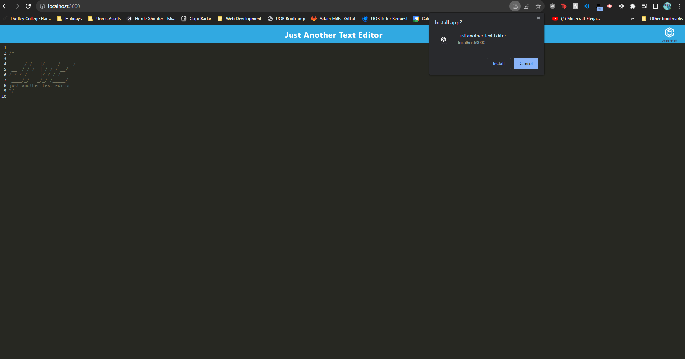
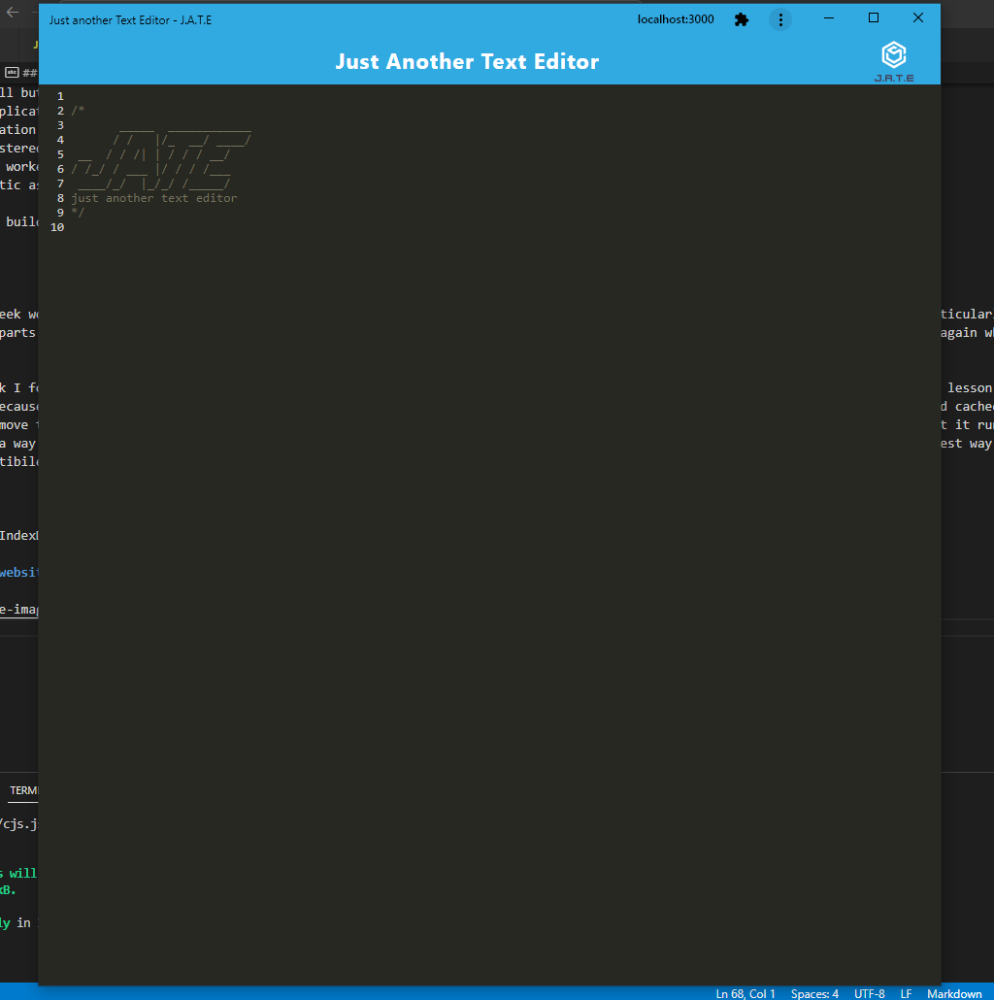
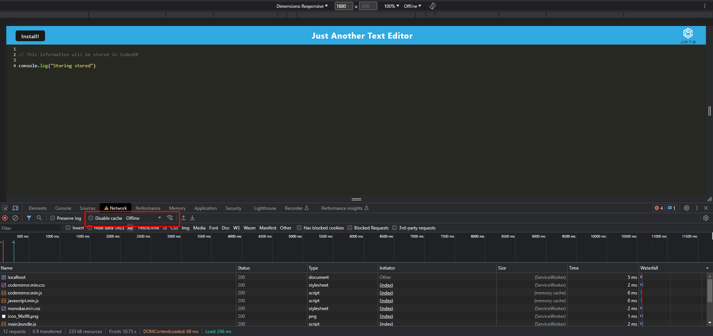

# PWA-Text-Editor

Progressive Web Application text editor that can be used offline

## Table of Content

- [Website](#website)
- [User Story & Acceptance Criteria](#user-story)
- [What I have learnt](#what-i-have-learnt)
- [Installation](#installation)
- [Usage](#usage)

## Website

[Heroku Webiste](https://jate-text-pwa-409736fe7e5c.herokuapp.com/)

## User Story

```md
AS A developer
I WANT to create notes or code snippets with or without an internet connection
SO THAT I can reliably retrieve them for later use
```

## Acceptance Criteria

```md
GIVEN a text editor web application
WHEN I open my application in my editor
THEN I should see a client server folder structure
WHEN I run `npm run start` from the root directory
THEN I find that my application should start up the backend and serve the client
WHEN I run the text editor application from my terminal
THEN I find that my JavaScript files have been bundled using webpack
WHEN I run my webpack plugins
THEN I find that I have a generated HTML file, service worker, and a manifest file
WHEN I use next-gen JavaScript in my application
THEN I find that the text editor still functions in the browser without errors
WHEN I open the text editor
THEN I find that IndexedDB has immediately created a database storage
WHEN I enter content and subsequently click off of the DOM window
THEN I find that the content in the text editor has been saved with IndexedDB
WHEN I reopen the text editor after closing it
THEN I find that the content in the text editor has been retrieved from our IndexedDB
WHEN I click on the Install button
THEN I download my web application as an icon on my desktop
WHEN I load my web application
THEN I should have a registered service worker using workbox
WHEN I register a service worker
THEN I should have my static assets pre cached upon loading along with subsequent pages and static assets
WHEN I deploy to Heroku
THEN I should have proper build scripts for a webpack application
```

## What I have learnt

This was an interesting week working with PWA (Progressive web applications) and they fit into the ecosystem of the online world. I found this week particularly difficult because of the amount of parts that you need to have set up for it to work properly. When you have it all set up, it is really easy to recreate and do again which is nice about this week.

On the other hand, I think I found it difficult to get many things working when within the small amount of time you have in the lesson and had a bit of lesson discovering when doing this project because even when you try hard to refresh your page to remove the old caching, a lot of the times it will still pull up your old cached changes and you have to completely remove the service workers from your application to get a full clean start. But learning about Babel and transpiling code so that it runs faster, is interesting because it's a way in today's world where every website has to be fast, it lets you get the edge over another website. Transpiling is the best way to make an efficient backwards compatibile website easily which is interesting to learn about and to use.

## Usage

Learnt about caching and IndexDB so this usage will be more focused on them

### Able to download the website and use it offline





### Stored data in IndexDB


### Use the application offline


